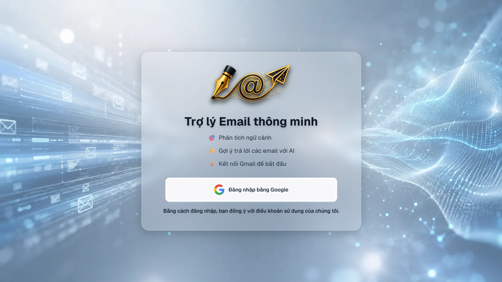
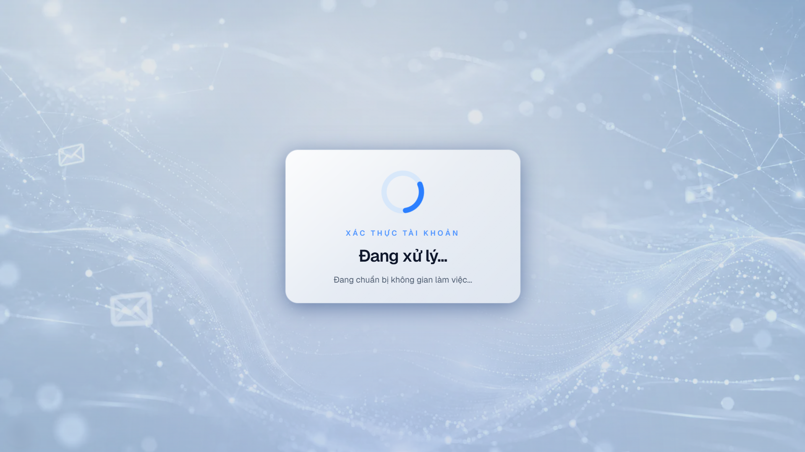
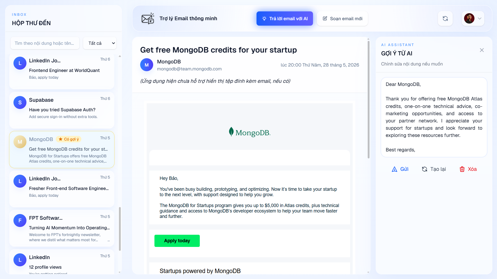
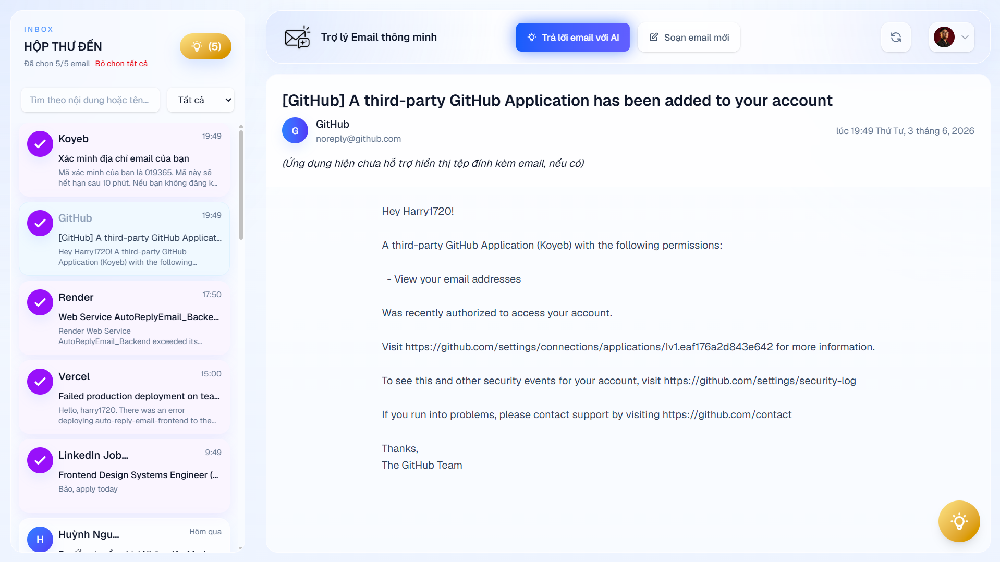
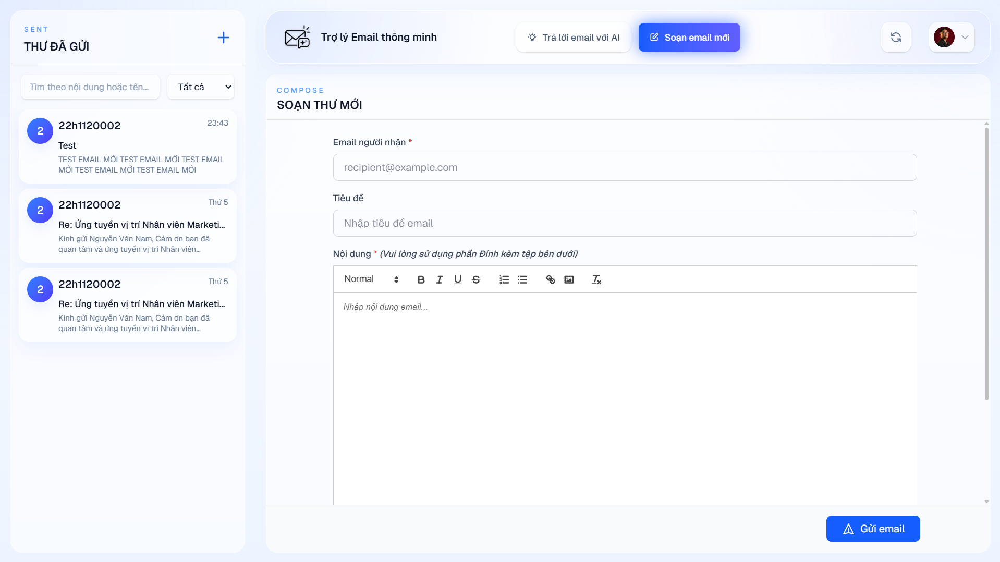
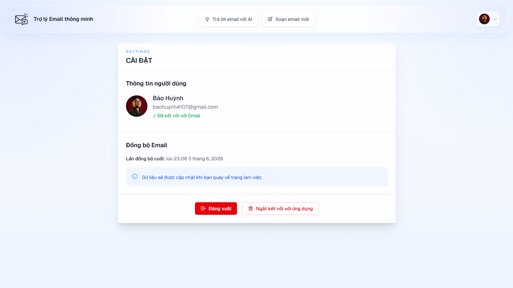

# Trợ lý Email Thông minh - Frontend

Đây là kho lưu trữ mã nguồn Frontend cho dự án **Trợ lý Email Thông minh** - một ứng dụng website hỗ trợ tự động gợi ý bản nháp trả lời email dựa trên văn phong cá nhân của người dùng, sử dụng trí tuệ nhân tạo (LLM) với mô hình Llama 3.3 70B Versatile thông qua Groq Cloud API.

# Mục lục

- [1. Tính năng chính](#1-tính-năng-chính)
- [2. Công nghệ sử dụng](#2-công-nghệ-sử-dụng)
- [3. Một số hình ảnh giao diện](#3-một-số-hình-ảnh-giao-diện)
- [4. Cấu trúc thư mục](#4-cấu-trúc-thư-mục)
- [5. Hướng dẫn cài đặt và khởi chạy (Local)](#5-hướng-dẫn-cài-đặt-và-khởi-chạy-local)
  - [5.1. Yêu cầu hệ thống](#51-yêu-cầu-hệ-thống)
  - [5.2. Cài đặt dependencies](#52-cài-đặt-dependencies)
  - [5.3. Cấu hình biến môi trường](#53-cấu-hình-biến-môi-trường)
  - [5.4. Khởi chạy ứng dụng](#54-khởi-chạy-ứng-dụng)
- [6. Tài liệu dự án](#6-tài-liệu-dự-án)
- [7. Luồng hoạt động cơ bản](#7-luồng-hoạt-động-cơ-bản)
- [8. Lỗi thường gặp (Troubleshooting)](#8-lỗi-thường-gặp-troubleshooting)
- [9. Thực hiện](#9-thực-hiện)
- [10. Mã nguồn Backend của dự án](#10-mã-nguồn-backend-của-dự-án)

## 1. Tính năng chính

- **Xác thực Google OAuth:** Đăng nhập an toàn bằng tài khoản Google và tích hợp trực tiếp với Gmail API.
- **Quản lý Email:** Xem danh sách, đọc chi tiết, lọc theo thời gian, tìm kiếm theo tên/ nội dung, phân trang và tải thêm email từ hộp thư đến/đã gửi.
- **Workspace:** Xem, tìm kiếm và quản lý hộp thư email đến với 3 phần trên giao diện gồm: Danh sách Email, Nội dung Email, và Bảng gợi ý AI.
- **Trả lời email với AI:** Yêu cầu tạo gợi ý trả lời, xem trước bản nháp do AI sinh ra, và hỗ trợ chỉnh sửa trực tiếp (inline editing) trước khi quyết định gửi, sử dụng mô hình LLM.
- **Soạn thảo Email:** Tích hợp Rich Text Editor (React Quill) cho phép soạn thảo, định dạng email, kèm tính năng đính kèm tệp.
- **Quản lý tài khoản:** Xem thông tin đồng bộ, ngắt kết nối tài khoản và xóa dữ liệu.
- **Giao diện Responsive:** Thiết kế hiện đại với Tailwind CSS.

## 2. Công nghệ sử dụng

Dự án được xây dựng với các công nghệ web hiện đại nhất:

- **Framework:** [Next.js 16](https://nextjs.org/) (App Router)
- **Library:** [React 19](https://react.dev/)
- **Ngôn ngữ:** [TypeScript](https://www.typescriptlang.org/)
- **Styling:** [Tailwind CSS v4](https://tailwindcss.com/)
- **Rich Text Editor:** `react-quill-new` & `dompurify`
- **Xác thực:** Google OAuth 2.0
- **Quản lý trạng thái & API Client:** Sử dụng React Hooks và giao tiếp với Backend thông qua JWT Token

## 3. Một số hình ảnh giao diện

<table>
  <tr>
    <td></td>
    <td></td>
  </tr>
  <tr>
    <td></td>
    <td></td>
  </tr>
  <tr>
    <td></td>
    <td></td>
  </tr>
</table>

## 4. Cấu trúc thư mục

```text
frontend/
├── src/
│   ├── app/                # Next.js App Router (pages, layouts, auth callbacks)
│   ├── components/         # Các UI components (EmailList, EmailComposer, AiSuggestionPanel, ...)
│   ├── services/           # Kết nối với Backend API
│   ├── types/              # Định nghĩa TypeScript interfaces/types
│   └── utils/              # Các hàm tiện ích (utilities)
├── public/                 # Chứa các file tĩnh (hình ảnh, icon...)
├── .env.example            # Mẫu file biến môi trường
├── package.json            # Cấu hình project và dependencies
└── tailwind.config.js / postcss.config.mjs # Cấu hình style
```

## 5. Hướng dẫn cài đặt và khởi chạy vắn tắt (Local)

Để có hướng dẫn chi tiết hơn, xem [Tài liệu dự án](#6-tài-liệu-dự-án), phần tài liệu hướng dẫn

### 5.1. Yêu cầu hệ thống

- Node.js 18+ (khuyên dùng bản LTS mới nhất)
- Backend API đang chạy (xem thêm hướng dẫn ở repo [backend](https://github.com/Harry1720/AppLLM_AutoReplyEmail_Backend))

### 5.2. Cài đặt dependencies

Di chuyển vào thư mục `frontend` và cài đặt các gói cần thiết:

```bash
cd frontend
npm install
# hoặc
yarn install
# hoặc
pnpm install
```

### 5.3. Cấu hình biến môi trường

Tạo một file `.env.local` từ file mẫu:

```bash
cp .env.example .env.local
```

Cập nhật các biến môi trường trong file `.env.local`:

```env
NEXT_PUBLIC_API_URL=http://localhost:8000
NEXT_PUBLIC_GOOGLE_CLIENT_ID=your_google_oauth_client_id_here
NEXT_PUBLIC_GOOGLE_REDIRECT_URI=http://localhost:3000/auth/callback
```

_(**Lưu ý:** Đảm bảo_ `NEXT_PUBLIC_GOOGLE_REDIRECT_URI` _đã được thêm vào danh sách URI chuyển hướng hợp lệ trong Google Cloud Console)._

### 5.4. Khởi chạy ứng dụng

Chạy development server:

```bash
npm run dev
```

Mở trình duyệt và truy cập <http://localhost:3000> để sử dụng ứng dụng.

## 6. Tài liệu dự án

- [Báo cáo](/frontend/DOCS/22H1120002_22H1120095_DeTai6_BaoCaoTTTN.pdf)
- [Hướng dẫn sử dụng](/frontend/DOCS/22H1120002_22H11200095_TaiLieuHDSD_DeTai6.pdf)
- [Hướng dẫn cài đặt](/frontend//DOCS/22H1120002_22H11200095_TaiLieuCaiDat_DeTai6.pdf)

**Tài liệu tuy ảnh giao diện cũ nhưng chức năng vẫn giữ nguyên.**

## 7. Luồng hoạt động cơ bản

1. **Đăng nhập:** Người dùng truy cập trang chủ và click "Bắt đầu với Google".
2. **Xác thực:** Ứng dụng chuyển hướng đến Google OAuth. Sau khi người dùng cấp quyền Gmail, Google trả về authorization code.
3. **Xử lý token:** Trang `/auth/callback` nhận code, gửi cho Backend (`POST /auth/google-login`) để đổi lấy JWT token.
4. **Workspace:** Người dùng được chuyển hướng vào không gian làm việc (`/workspace`), ứng dụng gọi API lấy danh sách email và cho phép thao tác (đọc, gửi, xóa, sinh câu trả lời AI).

## 8. Lỗi thường gặp (Troubleshooting)

- **Lỗi đăng nhập / Xác thực:** Kiểm tra lại `NEXT_PUBLIC_GOOGLE_CLIENT_ID` và URI chuyển hướng trong Google Cloud Console. Đảm bảo backend đang chạy.
- **Không lấy được danh sách email:** Mở Developer Tools trên trình duyệt kiểm tra Console / Network để xem JWT token đã được gắn vào Header của request chưa, hoặc tài khoản đã cấp đủ quyền đọc/gửi Gmail API chưa.
- **Lỗi CORS:** Chắc chắn Backend cho phép domain `http://localhost:3000` trong cấu hình CORS Middleware.

## 9. Thực hiện

- Huỳnh Nguyễn Quốc Bảo
- Phí Ngọc Thái Bình

_Trường Đại học Giao thông Vận tải TP.HCM_

## 10. Mã nguồn Backend của dự án

Truy cập: <https://github.com/Harry1720/AppLLM_AutoReplyEmail_Backend>
